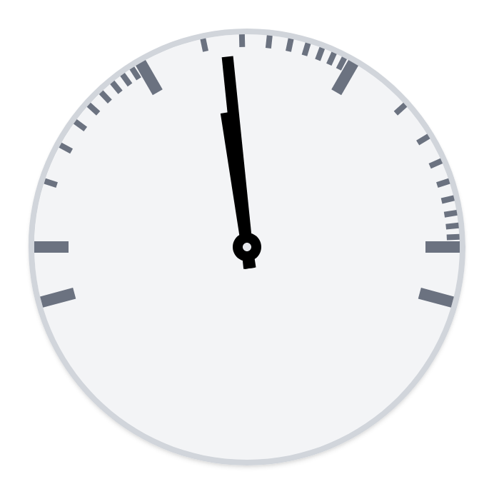

# Ping Clock Web

Web version of [the Ping Clock I saw on Hackaday](https://hackaday.com/2022/02/09/that-clock-on-the-wall-is-actually-a-network-ping-display/). This shows the current ping on a logaritmic scale on a clock.

This project is divided in two parts.

1. **Pinger**: A server program that pings a specified host.
2. **Display**: A web client that displays the pinged results on a clock display.

They communicate with eachother with websockets.

Check their respective readme files for more info:

- [Pinger](./pinger/README.md)
- [Display](./display/README.md)

## Hosting

There is a `docker-compose.yml` included which loads its settings from the `.env` file. Copy `.env.example` to see all values used.

- `DISPLAY_PORT`: Port on which the webclient is accessible.
- `SERVER_PORT`: Port on which the pinger websocket runs.

## TODO

- Add text labels to the clock
- Dark mode version
- Make a web-only version that can be hosted, but a suitable alternative to ping that runs in the browser must be chosen first.

## Credits

[Original Ping Clock repo by Turingbirds](https://github.com/turingbirds/ping-clock/)
